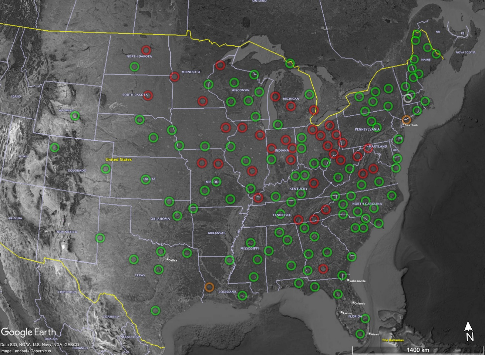

# SISBatteries
Get battery info from SIS; make a KML and some plots to help with maintenance planning.

Requires a SIS login and a Python environment with [fastkml](https://fastkml.readthedocs.io/en/latest/) installed.  I like to use conda for this.

Using SIS API to retrieve battery info is a to-do. For now, you must download a CSV yourself and rename it to n4batts.csv:

[SIS equipment search for N4 batteries, sorted by install date](https://anss-sis.scsn.org/sis/equipment/current/?page=4&catgids=31&istemplate=0&operatorids=1&isinstalled=1&netids=41&displaycols=category&displaycols=manufacturer&displaycols=modelname&displaycols=serialnumber&displaycols=ondate&displaycols=inventory&displaycols=operatorcode&displaycols=project&displaycols=ownercode&displaycols=propertytag&displaycols=epochnotes&displaycols=isinstalled&displaycols=netcode&displaycols=lookupcode&displaycols=monname&displaycols=installdate&o1=installdate&o1ad=a&o2=&o2ad=a&o3=&o3ad=a&o4=&o4ad=a&o5=&o5ad=a)

battery2kml.py reads a CSV list of batteries downloaded from SIS and generates a KML. 

battplot.py reads the same CSV and plots batteries by the year they were installed.

