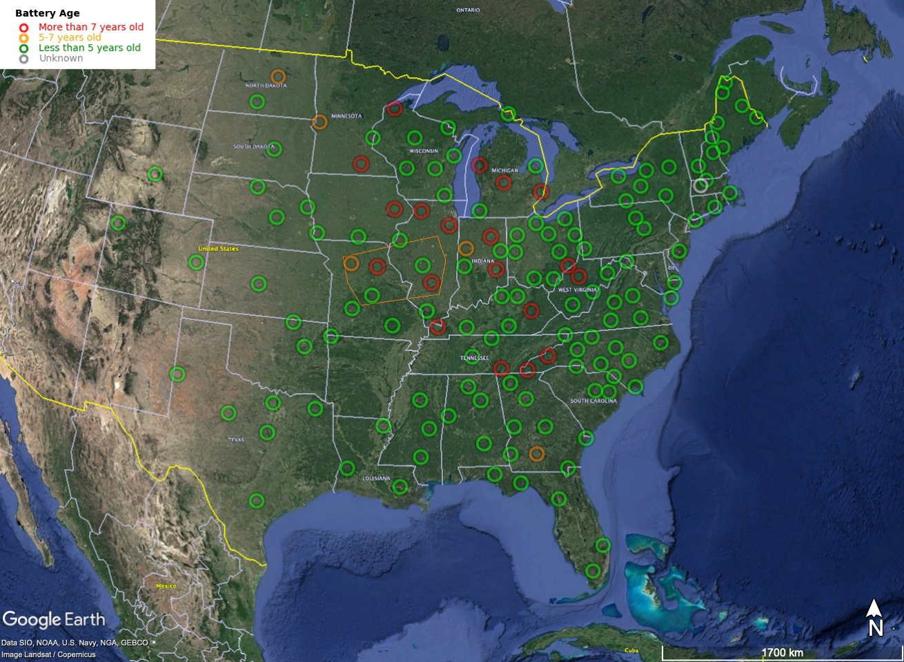

# SISBatteries
Get battery info from SIS; make a KML and some plots to help with maintenance planning.

battery2kml.py creates the output file kml/N4_battery_age.kml and kml/legend.png.

For operational use:  Users should download kml/N4BatteryAge_link.kml and open it in Google Earth.  kml/N4_battery_age.kml should be hosted on a server that can run a cron job to update it periodically (probably every night).  The link KML will sync with the updated file on a specified interval.

Running the code requires a SIS login and a Python environment with [fastkml](https://fastkml.readthedocs.io/en/latest/) installed.  I like to use conda for this.

The file sisutils.py contains a few simple functions that log a user into SIS, create an API query, and parse the returned text. These are in a separate file primarily to keep the other scripts focused on generating KMLs or plots.

To supply your SIS login credentials: Create a copy of config.ini.example named config.ini. Enter your SIS username and password. This file will be read by the loginSIS function in sisutils.py.

battery2kml.py obtains battery info from SIS and adds it to a pre-existing KML to produce an interactive map: 

battplot.py uses the same sisutils functions to query SIS. It makes a few plots, including a histogram showing the most recent battery swap at each station. 

Old way of obtaining CSV file - obsolete now that the API request is working:

To get data:
 - search Current Equipment in SIS, 
 - Equipment Category: Battery
 - Is Currently Installed: Yes
 - in columns to display: add Epoch On Date
 - sort by Epoch On Date
 - download CSV file
 
 [SIS equipment search for N4 batteries, sorted by install date](https://anss-sis.scsn.org/sis/equipment/current/?page=4&catgids=31&istemplate=0&operatorids=1&isinstalled=1&netids=41&displaycols=category&displaycols=manufacturer&displaycols=modelname&displaycols=serialnumber&displaycols=ondate&displaycols=inventory&displaycols=operatorcode&displaycols=project&displaycols=ownercode&displaycols=propertytag&displaycols=epochnotes&displaycols=isinstalled&displaycols=netcode&displaycols=lookupcode&displaycols=monname&displaycols=installdate&o1=installdate&o1ad=a&o2=&o2ad=a&o3=&o3ad=a&o4=&o4ad=a&o5=&o5ad=a)
 
[another older link I had been using](https://anss-sis.scsn.org/sis/equipment/current/?catgids=31&istemplate=0&operatorids=1&isinstalled=1&o1=ondate&o1ad=a&o2ad=a&o3ad=a&o4ad=a&o5ad=a&displaycols=category&displaycols=manufacturer&displaycols=modelname&displaycols=serialnumber&displaycols=ondate&displaycols=inventory&displaycols=operatorcode&displaycols=project&displaycols=ownercode&displaycols=propertytag&displaycols=epochnotes&displaycols=isinstalled&displaycols=netcode&displaycols=lookupcode&displaycols=monname)
